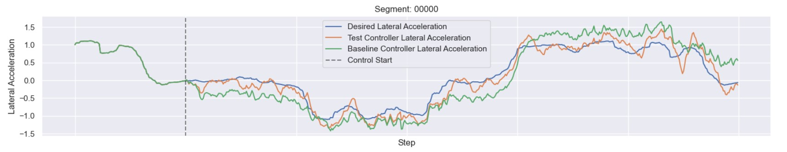

# Comma Controls Challenge!

## Self Improvement Approach

1. Encoder Model
- The encoder model will be trained on first 100 steps of trajectory with bidirectional attention to predict steer command.
- This is inspired by the inverse dynamic model in Video Pretraining (VPT paper).The idea is that with future info, the model will learn to predict the steer command more accurately.
- Then all the trajectories will be labelled by this encoder model. (Starting from 75 steps due to masking)
- A reward is computed for each trajectory based on the lataccel_cost and jerk_cost.

2. Decoder model (act as controller)
- The decoder model will be trained on generated data by the encoder model (filtered by the reward).
- The decoder model will predict the steer command and lateral acceleration of next step autoregressively.

## Results

1. The decoder model is able to predict the trend of the ground truth, but the accumulated error leads to high lataccel_cost.


A naive solution to this is to tune a PID controller to minimize the accumulated error.
A small scale experiment of 200 samples is conducted to mitigate the effect of PID approach. See results [here](./report-pid-ablation.html).
A reduction of 53.5% in cost (117.3->54.6) is observed as compared to decoder model with no PID. 
A small caveat maybe the PID version controller will have higher jerk_cost.

Note that the PID hparams are not tuned perfectly.

2. The neccesity of encoder model

Intuitively, the encoder model inspired by VPT paper with more information should able to predict the steer command better than decoder in limited data scenario.
However, while inspecting synthetic data generated by encoder model, the steer command predicted are often quite off as compared to original data.
By further validation using tinyphysics model, there are approximately 33% of samples generated have the cost lower than 80 (average cost of baseline).
Only good trajectories (low cost) will be used to train the decoder model.

## Future work

1. Investigate the need of encoder model in generating synthetic data after first iteration
- Since the decoder model is trained well, will it be able to generate better data then encoder?
- In terms of speed, encoder definitely wins.

2. The decoder model cannot correct itself when it drift away from target acceleration.
- I suspect the model cannot learn this skill of correcting itself by normal training method.
- The model does not take past error as a signal during training. Thus, this signal is important but ignored during inference.
- A small work around is to simply add a PID controller or other algorithm to control it, but this cannot be scaled.
- This is reminds me of the reason why comma wants to build a simulator to train the lateral control.

---


Machine learning models can drive cars, paint beautiful pictures and write passable rap. But they famously suck at doing low level controls. Your goal is to write a good controller. This repo contains a model that simulates the lateral movement of a car, given steering commands. The goal is to drive this "car" well for a given desired trajectory.


## Geting Started
We'll be using a synthetic dataset based on the [comma-steering-control](https://github.com/commaai/comma-steering-control) dataset for this challenge. These are actual routes with actual car and road states.

```
# download necessary dataset (~0.6G)
bash ./download_dataset.sh

# install required packages
pip install -r requirements.txt

# test this works
python tinyphysics.py --model_path ./models/tinyphysics.onnx --data_path ./data/SYNTHETIC_V0/00000.csv --debug --controller simple
```

There are some other scripts to help you get aggregate metrics: 
```
# batch Metrics of a controller on lots of routes
python tinyphysics.py --model_path ./models/tinyphysics.onnx --data_path ./data/SYNTHETIC_V0/ --num_segs 100 --controller simple

# generate a report comparing two controllers
python eval.py --model_path ./models/tinyphysics.onnx --data_path ./data/SYNTHETIC_V0/ --num_segs 100 --test_controller simple --baseline_controller open

```
You can also use the notebook at [`experiment.ipynb`](https://github.com/commaai/controls_challenge/blob/master/experiment.ipynb) for exploration.

## TinyPhysics
This is a "simulated car" that has been trained to mimic a very simple physics model (bicycle model) based simulator, given realistic driving noise. It is an autoregressive model similar to [ML Controls Sim](https://blog.comma.ai/096release/#ml-controls-sim) in architecture. It's inputs are the car velocity (`v_ego`), forward acceleration (`a_ego`), lateral acceleration due to road roll (`road_lataccel`), current car lateral acceleration (`current_lataccel`) and a steer input (`steer_action`) and predicts the resultant lateral acceleration fo the car.


## Controllers
Your controller should implement an [update function](https://github.com/commaai/controls_challenge/blob/1a25ee200f5466cb7dc1ab0bf6b7d0c67a2481db/controllers.py#L2) that returns the `steer_action`. This controller is then run in-loop, in the simulator to autoregressively predict the car's response.


## Evaluation
Each rollout will result in 2 costs:
- `lataccel_cost`: $\dfrac{\Sigma(actual\\_lat\\_accel - target\\_lat\\_accel)^2}{steps} * 100$

- `jerk_cost`: $\dfrac{\Sigma((actual\\_lat\\_accel\_t - actual\\_lat\\_accel\_{t-1}) / \Delta t)^2}{steps - 1} * 100$

It is important to minimize both costs. `total_cost`: $(lataccel\\_cost *5) + jerk\\_cost$

## Submission
Run the following command, and send us a link to your fork of this repo, and the `report.html` this script generates.
```
python eval.py --model_path ./models/tinyphysics.onnx --data_path ./data --num_segs 5000 --test_controller <insert your controller name> --baseline_controller simple
```

## Work at comma
Like this sort of stuff? You might want to work at comma!
https://www.comma.ai/jobs
